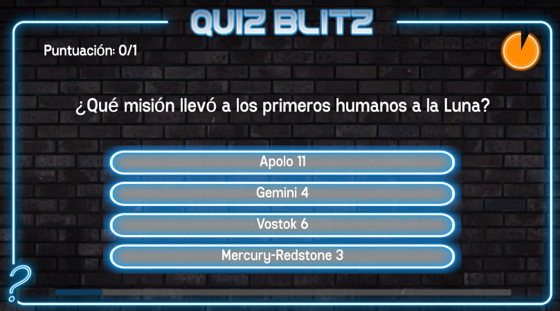
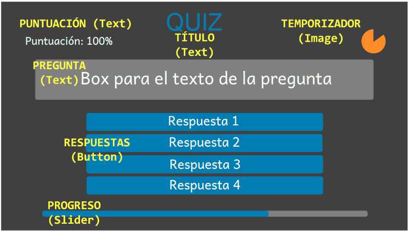

#### C.E. DVRV

### Programación y Motores de Videojuegos

#### Project: QuizBlitz

`[Unity ver.: 6.3.9f1]`

## Diseño

### Concepto

- **Título:** Quiz Blitz

- **Plataforma:** PC

- **Género:** Trivia

- **Cámara:** Juego 2D con vista cenital

- **Descripción:**

  - Juego de tipo prueba.

  - Preguntas multiopción de respuesta única.

  - Tiempo limitado por pregunta.

### Elementos de diseño

### Mecánicas

- Mecanismo para el almacenamiento, edición y la recuperación de las preguntas.

- El jugador seleccionará la respuesta de su elección pulsando el botón correspondiente a la misma.

- Por cada pregunta, existirá un temporizador para presionar al jugador.

- Se mostrará una barra con el progreso en el cuestionario.

- Se mostrará la puntuación actual del jugador.

- Existirá un mecanismo para el reinicio del juego.

### Operativa adicional

- Mecanismo de almacenamiento/edición externa de las preguntas (json).